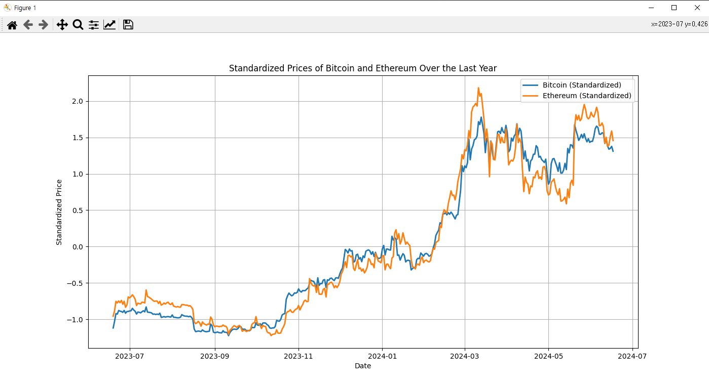
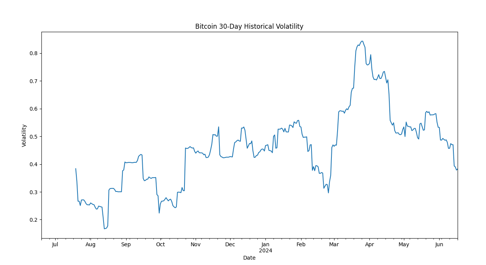
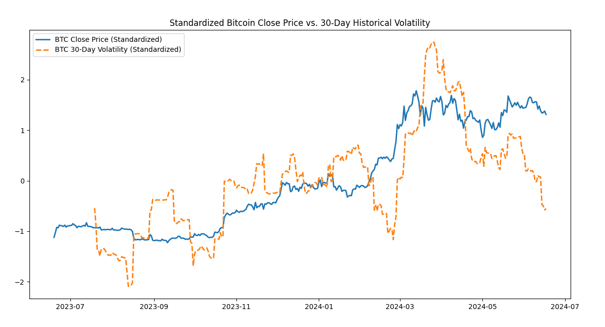
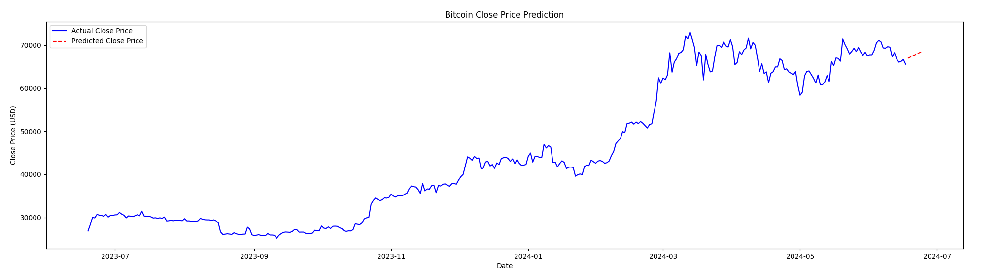
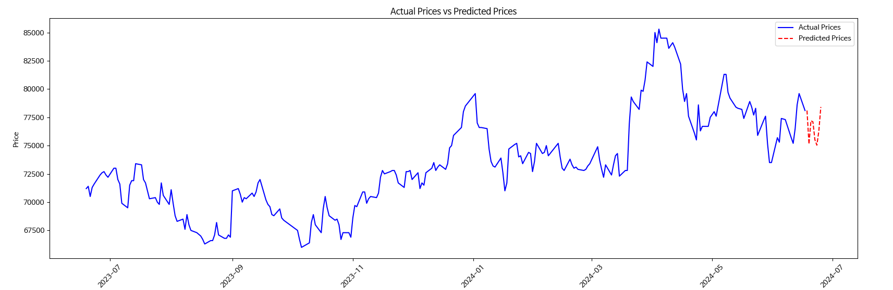

## 파이썬 가상환경

파이썬 가상환경에서 32비트를 별도로 사용한다면
### 1. 가상 환경을 생성 
```
python -m venv [가상환경이름]
```
### 2. 가상환경 활성화
```bash
$ source venv/bin/activate 

$ source venv/Scripts/activate  # windows

$ venv\Scripts\activate.bat     # cmd
```

### push 전 requirements.txt 생성
```bash
$ pip freeze > requirements.txt
```
### pull 후 가상환경에 패키지 설치
```bash
$ pip install -r requirements.txt
```

## 2개의 파이썬중 버전 선택
### 1. 생성한 가상환경 디렉토리 이동후 `pyvenv.cfg`열기
### 2. home 부분 수정
설치된 python이 2개이상일 경우 3.8.7이하의 버전을 선택해야 한다 (라이브러리가 최신버전을 지원 x)
```
home = C:\Python -> home = C:\Python32
```
### 3. 파이썬 인터프리터 변경 vs code에서 `Ctrl+Shift+P` 입력
Python Select Interpreter 설정에서 생성한 가상환경 선택
또는 윈도우에서
```
[가상환경이름]/Scripts/activate
```
Linux
```
source .venv/bin/activate
```
- 파이썬 파일 실행
```py
python [file].py
```


- 패키지 설치
```py
pip install [package]
```
- 설치된 라이브러리 목록 확인 > requirements.txt 생성
```py
pipreqs [src/]
```

## 해야할 일

1. kiwoom.py 분석

## 실행 결과

### 비트코인 이더리움 상관관계
```py
/src/graph (main)
$ python getCorrelationCoefficient.py
```


### 비트코인 30일간 역사적 변동성 체크
```py
/src/graph (main)
$ python getHistoricalVolatility.py

'''
최근 (24.04.06) 역사적 변동성은 0.7 => 대략 70% 변동성
비트코인 영업일 365의 제곱근은 대략 19
70 / 19 = 대략 3.7%
=> 하루 평균 3.7%가 변동되었다.
'''
```


### 비트코인 일별 수익률, 역사적 변동성 계산 및 표준화 그래프
비트코인의 종가와 변동성을 분석하여, 이 둘의 변화 패턴을 시각적으로 비교
```py
/src/graph (main)
$ python getHistoricalVolatilityAndStandardization.py 
```

### LSTM으로 분석한 향후 7일간의 비트코인 가격 예측
```py
/src/graph (main)
$ python getPredictedBTCbyLSTM.py

'''
실제 종가 (파란색 선): 지난 1년간의 비트코인 실제 종가
예측된 종가 (빨간색 점선): LSTM 모델을 사용하여 예측한 다음 7일간의 비트코인 종가
'''
```


### LSTM으로 분석한 향후 7일간의 삼성전자 가격 예측
```py
/src/graph (main)
$ python getPredictedStockByLSTM.py 
```
