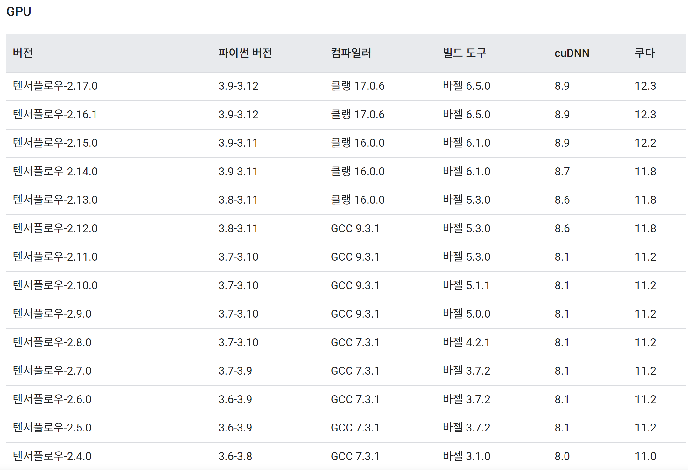
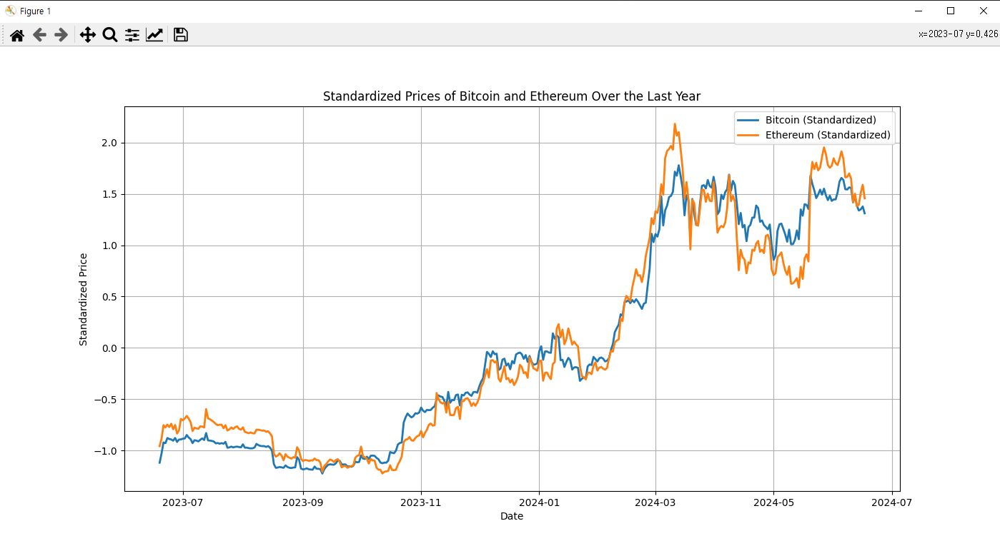
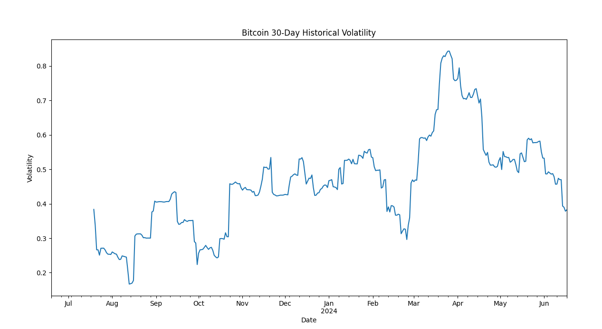
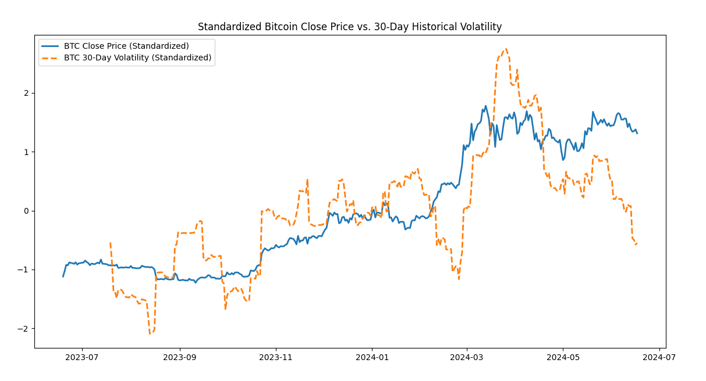
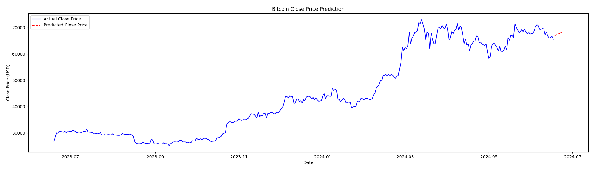
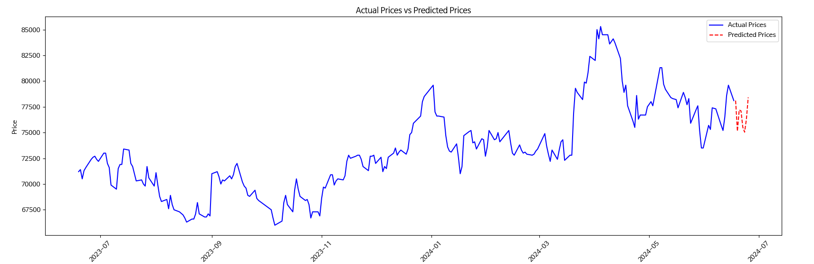

## 파이썬 가상환경

본 프로젝트의 파이썬은 3.8.7 버전이다

파이썬 가상환경에서 32비트를 별도로 사용한다면
- 가상 환경을 생성 
```
python -m venv [가상환경이름]
```
- 생성한 가상환경 디렉토리 이동후 `pyvenv.cfg`열기
- home 부분 수정
- 3.8.7 버전이 설치된 디렉토리로 지정한다 
```
home = C:\Python32
include-system-site-packages = false
version = 3.8.7
```
- 파이썬 인터프리터 변경 vs code에서 `Ctrl+Shift+P` 입력

Python Select Interpreter 설정에서 생성한 가상환경 선택 또는 아래 명령어
```bash
$ source venv/bin/activate 

$ source venv/Scripts/activate  # windows

$ venv\Scripts\activate.bat     # cmd
```
- 파이썬 파일 실행
```py
python [file].py
```


- 패키지 설치
```py
pip install [package]
```
- 설치된 라이브러리 목록 확인 > requirements.txt 생성
```py
pipreqs [src/]
```


### push 전 requirements.txt 생성
```bash
$ pip freeze > requirements.txt
```
### pull 후 가상환경에 패키지 설치
```bash
$ pip install -r requirements.txt
```

## CUDA 설치
https://www.tensorflow.org/install/source?hl=ko#gpu <br>위 링크에서 확인하면 설치된 tensorflow 버전에 따른 사용가능한 cuda 버전을 확인할 수 있다<br>


cuda download <br> https://developer.nvidia.com/cuda-11-8-0-download-archive?target_os=Windows&target_arch=x86_64&target_version=11&target_type=exe_local <br>

cuDNN 8.6 압축을 풀고 CUDA 설치 디렉토리 내의 `bin`, `include`, `lib` 폴더에 복사한다
설치 후 `nvcc --version` 명령어로 설치 확인 <br>

```
$ nvcc --version

nvcc: NVIDIA (R) Cuda compiler driver
Copyright (c) 2005-2022 NVIDIA Corporation
Built on Wed_Sep_21_10:41:10_Pacific_Daylight_Time_2022
Cuda compilation tools, release 11.8, V11.8.89
Build cuda_11.8.r11.8/compiler.31833905_0
```

아래 명령어로 텐서플로우가 gpu를 지원하는지 확인
```
$ python -c "import tensorflow as tf; print(tf.config.list_physical_devices('GPU'))"
```
빈 배열이 나온다면 텐서플로우 버전을 확인
```
$ pip show tensorflow

Name: tensorflow
Version: 2.13.0
Summary: TensorFlow is an open source machine learning framework for everyone.
Home-page: https://www.tensorflow.org/
Author: Google Inc.
Author-email: packages@tensorflow.org
License: Apache 2.0
Location: d:\project\autosales.py\venv\lib\site-packages
Requires: tensorflow-intel
Required-by:
```
`tensorflow-intel` 같은 경우 CPU를 기반으로 한 텐서플로우 이므로 다시 설치해야 한다.


## 실행 결과

### 비트코인 이더리움 상관관계
```py
/src/graph (main)
$ python getCorrelationCoefficient.py
```


### 비트코인 30일간 역사적 변동성 체크
```py
/src/graph (main)
$ python getHistoricalVolatility.py

'''
최근 (24.04.06) 역사적 변동성은 0.7 => 대략 70% 변동성
비트코인 영업일 365의 제곱근은 대략 19
70 / 19 = 대략 3.7%
=> 하루 평균 3.7%가 변동되었다.
'''
```


### 비트코인 일별 수익률, 역사적 변동성 계산 및 표준화 그래프
비트코인의 종가와 변동성을 분석하여, 이 둘의 변화 패턴을 시각적으로 비교
```py
/src/graph (main)
$ python getHistoricalVolatilityAndStandardization.py 
```

### LSTM으로 분석한 향후 7일간의 비트코인 가격 예측
```py
/src/graph (main)
$ python getPredictedBTCbyLSTM.py

'''
실제 종가 (파란색 선): 지난 1년간의 비트코인 실제 종가
예측된 종가 (빨간색 점선): LSTM 모델을 사용하여 예측한 다음 7일간의 비트코인 종가
'''
```


### LSTM으로 분석한 향후 7일간의 삼성전자 가격 예측
```py
/src/graph (main)
$ python getPredictedStockByLSTM.py 
```
w

### 리눅스 파이선 3.8 설치
```
wget https://www.python.org/ftp/python/3.8.11/Python-3.8.11.tgz
tar -zxvf Python-3.8.11.tgz
cd Python-3.8.11
./configure --enable-optimizations
make altinstall
vi /root/.bashrc
alias python="/usr/local/bin/python3.8" 추가
source /root/.bashrc
```